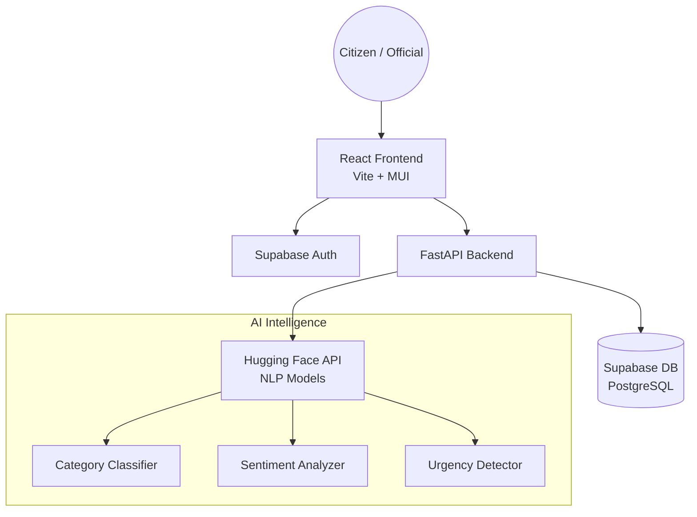
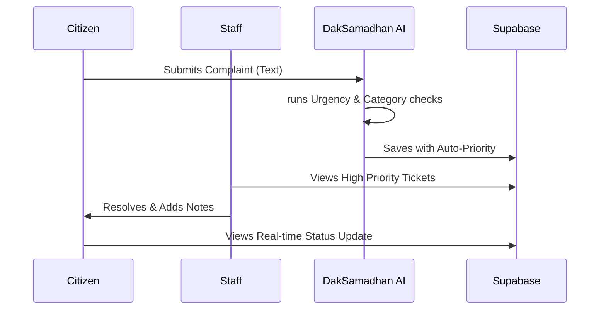

<div align="center">
  
  
  # 🏢 DakSamadhan-AI
  
  **Next-Generation AI Grievance Redressal System for Department of Posts**

  <p align="center">
    <strong>Intelligent Categorization • Sentiment Analysis • Automated Prioritization</strong>
  </p>

  <p align="center">
    
    
    
    
    
  </p>
</div>

---

## 📖 Overview

**DakSamadhan-AI** originated as a visionary prototype for **Postathan**, a competition conducted at the college level to solve real-world logistical and service challenges. What began as an interest-driven project has evolved into a fully functional **Minimum Viable Product (MVP)** with the potential to scale across diverse service sectors.

The system is a state-of-the-art grievance management platform designed to streamline communication between citizens and the Department of Posts. By leveraging **Natural Language Processing (NLP)**, it automatically analyzes, categorizes, and prioritizes complaints, ensuring that critical issues like missing contents or fraudulent activity are escalated instantly.

Built with a **FastAPI** backend and a **React + MUI** frontend, the platform integrates seamlessly with **Supabase** for secure authentication and real-time database operations, while utilizing **Hugging Face's Inference API** for lightweight, production-grade AI analysis.

> [!IMPORTANT]
> **Disclaimer**: This project is an independent research prototype developed as an evolution of a "Postathan" college initiative. It is **not** an official application of, nor is it endorsed by, the Department of Posts or any government entity. All logos and names are used for representative/illustrative purposes for this MVP.

---

## ✨ Key Features

| Feature | Description |
| --- | --- |
| 🧠 **Dual-Pass AI Analysis** | Concurrent zero-shot classification and urgency detection using Hugging Face's `BART-large-MNLI`. |
| 🛡️ **Bias-Free Tracking** | Intelligent UI that hides "Low" priority and sentiment labels from customers to ensure a positive perception. |
| 📋 **Automated History**| Logged-in citizens see their complete complaint history automatically, no tracking codes required. |
| 🕵️ **Fraud Detection** | Specialized AI labels for "Missing Contents" and "Fraudulent Activity" that force immediate "High" priority. |
| 🔐 **Dual Portals** | Secure, distinct workflows for **Citizens** (submission/tracking) and **Officials** (resolution/analytics). |
| ⚡ **Micro-Service Ready** | Decoupled architecture optimized for free-tier hosting on **Render** (Backend) and **Vercel** (Frontend). |

---

## 🏗️ System Architecture

The application follows a modern full-stack architecture, utilizing cloud-native services for maximum scalability and minimal maintenance.



---

## 🚦 User Workflow



---

## 🛠️ Technology Stack

- **Frontend:** [React](https://reactjs.org/) + [Vite](https://vitejs.dev/) + [Material UI (MUI)](https://mui.com/)
- **Backend:** [FastAPI](https://fastapi.tiangolo.com/) + [Uvicorn](https://www.uvicorn.org/)
- **Database/Auth:** [Supabase](https://supabase.com/) (PostgreSQL + GoTrue)
- **AI/NLP:** [Hugging Face Inference API](https://huggingface.co/inference-api)
- **Data Management:** [TanStack Query (React Query)](https://tanstack.com/query/latest)

---

## 🚀 Getting Started

### Prerequisites
* Python 3.9+
* Node.js v18+
* Supabase Account (URL & Keys)
* Hugging Face API Token

### Installation

1. **Clone & Setup Backend:**
   ```bash
   cd backend
   python -m venv venv
   source venv/bin/activate  # or venv\Scripts\activate
   pip install -r requirements.txt
   cp .env.example .env
   # Update .env with your Supabase & HF keys
   uvicorn app.main:app --reload
   ```

2. **Setup Frontend:**
   ```bash
   cd ../frontend
   npm install
   cp .env.example .env
   # Update .env with backend URL and Supabase Anon Key
   npm run dev
   ```

---

## 📁 Repository Structure

```text
DakSamadhan-AI/
├── backend/                # FastAPI Application
│   ├── app/
│   │   ├── api/            # API Endpoints (Complaints, Stats)
│   │   ├── core/           # Configuration & DB Clients
│   │   └── nlp/            # AI Classifiers & Logic
│   └── requirements.txt    # Lean dependencies
├── frontend/               # React Application
│   ├── src/
│   │   ├── components/     # UI Building Blocks
│   │   ├── pages/          # Full Page Views (Dashboard, Track, etc.)
│   │   └── services/       # Supabase & API Utilities
│   └── vite.config.ts      # Frontend Build Settings
└── README.md
```

---

## 🔐 Environment Variables

Ensure the following variables are established in your production environment:

**Backend:**
- `SUPABASE_URL` / `SUPABASE_KEY` (Service Role)
- `HF_API_KEY` (Hugging Face)
- `ALLOWED_ORIGINS` (CORS)

**Frontend:**
- `VITE_SUPABASE_URL` 
- `VITE_SUPABASE_ANON_KEY`
- `VITE_API_URL` (Backend Endpoint)

---

## 👤 Credits & Contact

Developed and Maintained by **Dheeraj Papani**.

<a href="https://github.com/dheerajpapani">
  
</a>
<a href="https://www.linkedin.com/in/dheeraj-papani-507693274/">
  
</a>
